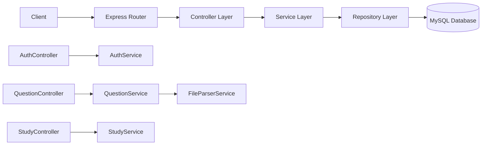
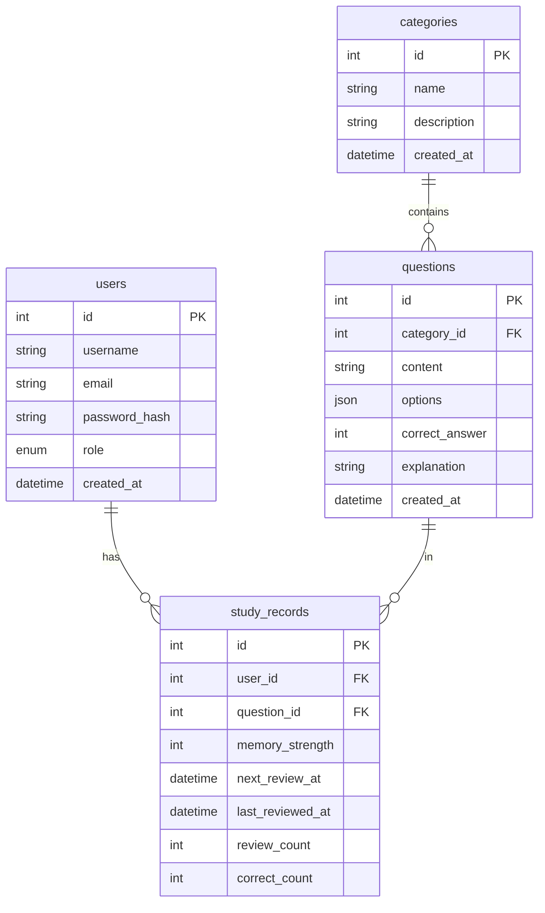

## 1. Architecture Design

```mermaid
graph TB
    subgraph "Frontend (React)"
        A[Dashboard Page]
        B[Study Page]
        C[Question Bank Page]
        D[Profile Page]
        E[Components]
    end
    
    subgraph "Backend (Express)"
        F[Auth Controller]
        G[Question Controller]
        H[Study Controller]
        I[File Parser Service]
    end
    
    subgraph "Database (MySQL)"
        J[(users)]
        K[(questions)]
        L[(study_records)]
        M[(categories)]
    end
    
    A --&gt; H
    B --&gt; H
    C --&gt; G
    D --&gt; F
    E --&gt; A
    E --&gt; B
    E --&gt; C
    E --&gt; D
    
    F --&gt; J
    G --&gt; K
    G --&gt; M
    H --&gt; K
    H --&gt; L
    I --&gt; G
```

## 2. Technology Description

- **Frontend**: React@18 + TypeScript + tailwindcss@3 + vite + react-router-dom@6 + zustand
- **Backend**: Express@4 + TypeScript
- **Database**: MySQL 8.0
- **File Parsing**: python-docx + python-pptx (Python服务)
- **Initialization Tool**: vite-init with react-express-ts template

## 3. Route Definitions

| Route | Purpose |
|-------|---------|
| / | 首页/仪表盘 |
| /study | 学习页面 |
| /questions | 题库管理 |
| /questions/import | 题目导入 |
| /profile | 个人中心 |
| /login | 登录页面 |

## 4. API Definitions

### 4.1 TypeScript Types

```typescript
interface User {
  id: number;
  username: string;
  email: string;
  role: 'user' | 'admin';
  createdAt: Date;
}

interface Question {
  id: number;
  categoryId: number;
  content: string;
  options: string[];
  correctAnswer: number;
  explanation: string;
  createdAt: Date;
}

interface Category {
  id: number;
  name: string;
  description: string;
}

interface StudyRecord {
  id: number;
  userId: number;
  questionId: number;
  memoryStrength: number;
  nextReviewAt: Date;
  lastReviewedAt: Date;
  reviewCount: number;
  correctCount: number;
}

interface DailyTask {
  questionId: number;
  isNew: boolean;
}
```

### 4.2 API Endpoints

#### Auth
- `POST /api/auth/login` - 用户登录
- `POST /api/auth/logout` - 用户登出
- `GET /api/auth/me` - 获取当前用户信息

#### Questions
- `GET /api/questions` - 获取题目列表
- `GET /api/questions/:id` - 获取单题详情
- `POST /api/questions` - 创建题目
- `PUT /api/questions/:id` - 更新题目
- `DELETE /api/questions/:id` - 删除题目
- `POST /api/questions/import` - 导入题目(Word/PPT)

#### Categories
- `GET /api/categories` - 获取分类列表
- `POST /api/categories` - 创建分类

#### Study
- `GET /api/study/today` - 获取今日复习任务
- `POST /api/study/answer` - 提交答案
- `GET /api/study/progress` - 获取学习进度
- `GET /api/study/stats` - 获取学习统计

## 5. Server Architecture Diagram



## 6. Data Model

### 6.1 Data Model Definition



### 6.2 Data Definition Language

```sql
-- 用户表
CREATE TABLE users (
    id INT AUTO_INCREMENT PRIMARY KEY,
    username VARCHAR(50) NOT NULL UNIQUE,
    email VARCHAR(100) NOT NULL UNIQUE,
    password_hash VARCHAR(255) NOT NULL,
    role ENUM('user', 'admin') DEFAULT 'user',
    created_at DATETIME DEFAULT CURRENT_TIMESTAMP
);

-- 分类表
CREATE TABLE categories (
    id INT AUTO_INCREMENT PRIMARY KEY,
    name VARCHAR(100) NOT NULL,
    description TEXT,
    created_at DATETIME DEFAULT CURRENT_TIMESTAMP
);

-- 题目表
CREATE TABLE questions (
    id INT AUTO_INCREMENT PRIMARY KEY,
    category_id INT,
    content TEXT NOT NULL,
    options JSON NOT NULL,
    correct_answer INT NOT NULL,
    explanation TEXT,
    created_at DATETIME DEFAULT CURRENT_TIMESTAMP,
    FOREIGN KEY (category_id) REFERENCES categories(id) ON DELETE SET NULL
);

-- 学习记录表
CREATE TABLE study_records (
    id INT AUTO_INCREMENT PRIMARY KEY,
    user_id INT NOT NULL,
    question_id INT NOT NULL,
    memory_strength INT DEFAULT 0,
    next_review_at DATETIME,
    last_reviewed_at DATETIME,
    review_count INT DEFAULT 0,
    correct_count INT DEFAULT 0,
    created_at DATETIME DEFAULT CURRENT_TIMESTAMP,
    FOREIGN KEY (user_id) REFERENCES users(id) ON DELETE CASCADE,
    FOREIGN KEY (question_id) REFERENCES questions(id) ON DELETE CASCADE,
    UNIQUE KEY unique_user_question (user_id, question_id)
);

-- 初始数据
INSERT INTO categories (name, description) VALUES
('通信基础知识', '通信岗位基础题目'),
('专业技能', '专业技能题目');

-- 示例题目
INSERT INTO questions (category_id, content, options, correct_answer, explanation) VALUES
(1, '光纤通信中，常用的波长窗口是？', '["850nm", "1310nm", "1550nm", "以上都是"]', 3, '光纤通信常用三个波长窗口包括850nm、1310nm和1550nm');

-- 示例用户 (密码: admin123)
INSERT INTO users (username, email, password_hash, role) VALUES
('admin', 'admin@example.com', '$2b$10$N9qo8uLOickgx2ZMRZoMyeIjZAgcfl7p92ldGxad68LJZdL17lhWy', 'admin'),
('testuser', 'user@example.com', '$2b$10$N9qo8uLOickgx2ZMRZoMyeIjZAgcfl7p92ldGxad68LJZdL17lhWy', 'user');
```

### 6.3 艾宾浩斯记忆曲线算法
```typescript
// 记忆强度对应的复习间隔（天）
const REVIEW_INTERVALS = [0, 1, 2, 4, 7, 15, 30];

function calculateNextReview(memoryStrength: number): Date {
    const interval = REVIEW_INTERVALS[Math.min(memoryStrength, REVIEW_INTERVALS.length - 1)];
    const nextReview = new Date();
    nextReview.setDate(nextReview.getDate() + interval);
    return nextReview;
}

function updateMemoryStrength(isCorrect: boolean, currentStrength: number): number {
    if (isCorrect) {
        return Math.min(currentStrength + 1, REVIEW_INTERVALS.length - 1);
    } else {
        return Math.max(0, currentStrength - 1);
    }
}
```
