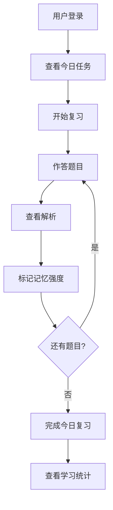

## 1. Product Overview
- 企业员工答题复习系统，帮助C类通信岗位员工高效准备转岗考试，基于科学记忆规律安排每日复习内容
- 支持从Word/PPT文档导入题目，提供电脑端和移动端适配的学习界面

## 2. Core Features

### 2.1 User Roles
| Role | Registration Method | Core Permissions |
|------|---------------------|------------------|
| 员工用户 | 账号密码登录 | 每日复习、题目练习、进度查看 |
| 管理员 | 账号密码登录 | 题目管理、用户管理、数据统计 |

### 2.2 Feature Module
1. **首页/仪表盘**: 今日复习任务、学习进度概览、快捷入口
2. **题库管理**: Word/PPT导入、题目编辑、分类管理
3. **学习页面**: 题目作答、答案解析、记忆强度标记
4. **复习计划**: 艾宾浩斯记忆曲线安排、复习进度追踪
5. **个人中心**: 学习数据统计、个人信息管理

### 2.3 Page Details
| Page Name | Module Name | Feature description |
|-----------|-------------|---------------------|
| 首页 | 学习概览 | 显示今日需复习题目数、已完成数、学习进度条 |
| 首页 | 快速开始 | 一键进入今日复习或随机练习 |
| 题库管理 | 题目导入 | 支持上传Word/PPT文件，自动解析题目 |
| 题库管理 | 题目列表 | 按分类筛选、搜索、编辑、删除题目 |
| 学习页面 | 答题界面 | 单题展示、选项选择、答案提交 |
| 学习页面 | 解析页面 | 显示正确答案、详细解析、记忆强度调整 |
| 复习计划 | 复习日程 | 展示每日复习安排、记忆曲线可视化 |
| 个人中心 | 数据统计 | 学习时长、正确率、进步趋势图表 |

## 3. Core Process

### 3.1 主要用户流程
1. 用户登录进入系统
2. 查看今日复习任务
3. 开始复习，逐题作答
4. 根据答题情况标记记忆强度
5. 系统根据艾宾浩斯曲线安排下次复习时间
6. 查看学习进度和统计数据

### 3.2 管理员流程
1. 管理员登录
2. 上传Word/PPT题库文件
3. 系统解析并导入题目
4. 管理和审核题目
5. 查看用户学习数据

## 4. User Interface Design

### 4.1 Design Style
- **主色调**: 深蓝色 (#1e40af) + 浅蓝 (#3b82f6)，传达专业、可靠的感觉
- **辅助色**: 绿色 (#10b981) 表示正确，橙色 (#f59e0b) 表示提醒，红色 (#ef4444) 表示错误
- **按钮风格**: 圆角矩形 (border-radius: 8px)，带有悬停阴影效果
- **字体**: 使用 Inter 或系统默认字体，标题 24px-32px，正文 14px-16px
- **布局风格**: 卡片式布局，清晰的区域分隔，充足的留白
- **图标风格**: 使用线性图标，简洁现代

### 4.2 Page Design Overview
| Page Name | Module Name | UI Elements |
|-----------|-------------|-------------|
| 首页 | 学习概览 | 大卡片展示关键数据，进度条动画，渐变背景 |
| 学习页面 | 答题界面 | 居中布局，大字体题目，清晰的选项按钮 |
| 题库管理 | 导入页面 | 拖拽上传区域，文件预览，解析进度条 |

### 4.3 Responsiveness
- **设计策略**: Desktop-first，自适应布局
- **断点**: 移动端 (≤ 640px)、平板 (≤ 1024px)、桌面端 (&gt; 1024px)
- **触控优化**: 按钮最小 44x44px，足够的点击区域，适合手机操作

### 4.4 交互设计
- 页面加载动画
- 答题反馈动效
- 学习进度平滑更新
- 记忆曲线动态展示
